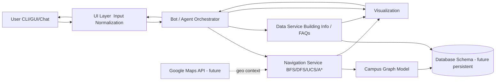

# CU PathFinder – Week 2 System Design & Architecture Report

## 1. System Architecture Overview
The CU PathFinder system is organized as a layered, modular architecture to allow incremental evolution from a local in‑memory prototype (Week 1–2) to a richer intelligent assistant (future weeks). It separates concerns into User Interaction, Intelligence (NLP + Agent Logic), Core Navigation (Search/Graph), Data Management, and Integration / Visualization.

### 1.1 High-Level Data & Control Flow
1. User submits a query (structured form, GUI selection, or future natural language input).
2. UI forwards normalized intent (source, destination, requested algorithm, info type) to Bot Engine.
3. Bot Engine validates inputs against Campus Data Layer (buildings table/graph) and resolves ambiguities (partial name match).
4. Navigation Module executes selected search algorithm on Graph Model (campus representation) → generates path + metrics.
5. Data Layer enriches result with building metadata, services, events, FAQs if requested.
6. Visualization Layer (optional) renders textual / graphical map or highlighted path.
7. Bot Engine composes response (text blocks + structured data + optional chart) → UI returns to user.
8. (Planned) Analytics persistence records run for later comparison and learning.

### 1.2 Architecture Block Diagram (ASCII)
```
+---------------------------+        +---------------------------+
|         End User          |        |  External Integrations    |
|  (CLI / Tkinter / Chat)   |        | (Google Maps API - future)|
+-------------+-------------+        +-------------+-------------+
              | (1) Input / Query                  |
              v                                    |
        +-----+---------------------------+        |
        |     User Interface Layer        |<-------+ (Map tile / geo enrichment)
        |  - CLI Parser                   |
        |  - GUI (Tkinter)                |
        |  - Chatbot Adapter (future)     |
        +---------------+-----------------+
                        | (2) Normalized Intent
                        v
        +---------------+-----------------+
        |   Bot / Agent Orchestration     |
        |  - Intent Dispatcher            |
        |  - Validation & Disambiguation  |
        |  - Response Composer            |
        +---------+-----------+-----------+
                  |           |
      (3a) Path Request   (3b) Data/Info Request
                  |           |
                  v           v
        +---------+-----------+-----------+
        |       Core Services Layer       |
        |  Navigation / Pathfinding       |
        |   * BFS / DFS / UCS / A*        |
        |  Alt Routes (future)            |
        |  Heuristic Manager              |
        +---------+-----------+-----------+
                  | (4) Graph Access / Metrics
                  v
        +---------+-----------+-----------+
        |      Data Management Layer      |
        |  In-Memory Graph (current)      |
        |  Persistence DB (future)        |
        |  Schemas: buildings, paths,     |
        |  staff, events, FAQs, runs      |
        +---------+-----------+-----------+
                  | (5) Enriched Data
                  v
        +---------+-----------+-----------+
        | Visualization & Reporting       |
        | - Textual Path Rendering        |
        | - ASCII / Graph Image           |
        | - Metrics Table / Export        |
        +---------------------------------+
```

### 1.3 Mermaid Diagram (For Docs / GitHub)


## 2. Module Definitions & Responsibilities
| Module | Responsibilities | Current Status | Future Extensions |
|--------|------------------|----------------|------------------|
| User Interface | Collect user queries (source, destination, algorithm); Display results | CLI + Tkinter GUI implemented | Chatbot (Rasa / Dialogflow), Web UI |
| NLP & Bot Engine | Parse natural language, identify intents/entities, resolve ambiguity | Placeholder (basic string matching) | Intent classification, entity extraction, FAQ ranking |
| Navigation / Pathfinding | Execute BFS, DFS, UCS, A*; compute metrics; alternative route planning | Core algorithms done | K-shortest paths, dynamic edge weights (crowds), accessibility filters |
| Campus Graph Model | Store nodes (buildings), edges (distances), heuristics (coordinates) | Implemented (`CampusGraph`) | Persisted DB-backed graph, directional/path closure flags |
| Data Service | Retrieve building info, services, hours, staff data, FAQs | Building info dictionary | Move to DB, caching layer |
| Visualization | Text route print, ASCII map, optional matplotlib / networkx diagrams | Text + Python plotting scaffold | Interactive map, path animation |
| Analytics & Logging | Capture algorithm performance stats per run | Stats object in memory | Persist runs, CSV/JSON export, dashboard |
| Persistence Layer | Provide CRUD over campus data | Not yet (in-memory only) | SQLite/PostgreSQL integration, migrations |
| Recommendation Engine | Suggest alternates if closed/unavailable or optimize by context | Not started | Service ranking, nearest open facility |

## 3. Database Design (Proposed Schema)
Initial prototype uses in-memory structures; below is the relational schema for persistence (SQLite/PostgreSQL).

### 3.1 Entity-Relationship Overview
Entities: buildings, paths, building_services, staff, events, faqs, algorithm_runs.

```
Buildings (1)──< Paths >──(1) Buildings (self referencing as edges)
Buildings (1)──< Building_Services
Buildings (1)──< Staff
Buildings (1)──< Events
Buildings (1)──< Algorithm_Runs (source/destination as FKs)
```

### 3.2 Table Definitions (DDL Draft)
```sql
-- Buildings master
CREATE TABLE buildings (
  building_id       INTEGER PRIMARY KEY AUTOINCREMENT,
  name              TEXT NOT NULL UNIQUE,
  code              TEXT UNIQUE,
  category          TEXT,                -- Academic, Admin, Service, Residential, Recreation
  description       TEXT,
  services_summary  TEXT,
  hours_open        TEXT,                -- e.g."08:00-20:00" 
  latitude          REAL,                -- Optional(For Future)
  longitude         REAL,
  accessible        BOOLEAN DEFAULT 1,   -- Wheelchair accessible flag
  created_at        TIMESTAMP DEFAULT CURRENT_TIMESTAMP
);

-- Paths (graph edges)
CREATE TABLE paths (
  path_id           INTEGER PRIMARY KEY AUTOINCREMENT,
  from_building_id  INTEGER NOT NULL REFERENCES buildings(building_id) ON DELETE CASCADE,
  to_building_id    INTEGER NOT NULL REFERENCES buildings(building_id) ON DELETE CASCADE,
  distance_m        INTEGER NOT NULL CHECK(distance_m > 0),
  is_one_way        BOOLEAN DEFAULT 0,
  avg_speed_mpm     INTEGER DEFAULT 80,  -- if need speed can increase
  last_verified_at  TIMESTAMP,
  UNIQUE(from_building_id, to_building_id)
);
CREATE INDEX idx_paths_from ON paths(from_building_id);
CREATE INDEX idx_paths_to   ON paths(to_building_id);

-- Services available inside buildings
CREATE TABLE building_services (
  service_id        INTEGER PRIMARY KEY AUTOINCREMENT,
  building_id       INTEGER NOT NULL REFERENCES buildings(building_id) ON DELETE CASCADE,
  service_name      TEXT NOT NULL,
  service_hours     TEXT,              -- Simple string 
  contact_info      TEXT
);

-- Staff directory (optional future integration)
CREATE TABLE staff (
  staff_id          INTEGER PRIMARY KEY AUTOINCREMENT,
  name              TEXT NOT NULL,
  role              TEXT,
  department        TEXT,
  office_building_id INTEGER REFERENCES buildings(building_id),
  office_room       TEXT,
  email             TEXT,
  phone             TEXT,
  availability_hours TEXT
);
CREATE INDEX idx_staff_building ON staff(office_building_id);

-- Events (talks, workshops, cultural programs)
CREATE TABLE events (
  event_id          INTEGER PRIMARY KEY AUTOINCREMENT,
  title             TEXT NOT NULL,
  description       TEXT,
  building_id       INTEGER REFERENCES buildings(building_id),
  start_time        TIMESTAMP,
  end_time          TIMESTAMP,
  audience          TEXT,       -- Students, Faculty, Public
  status            TEXT DEFAULT 'scheduled'
);
CREATE INDEX idx_events_building ON events(building_id);
CREATE INDEX idx_events_time ON events(start_time);

-- FAQs knowledge base
CREATE TABLE faqs (
  faq_id            INTEGER PRIMARY KEY AUTOINCREMENT,
  question          TEXT NOT NULL,
  answer            TEXT NOT NULL,
  category          TEXT,
  created_at        TIMESTAMP DEFAULT CURRENT_TIMESTAMP
);

-- Algorithm run analytics
CREATE TABLE algorithm_runs (
  run_id            INTEGER PRIMARY KEY AUTOINCREMENT,
  source_building_id INTEGER REFERENCES buildings(building_id),
  dest_building_id   INTEGER REFERENCES buildings(building_id),
  algorithm          TEXT NOT NULL,           -- BFS / DFS / UCS / A*
  distance_m         INTEGER,
  path_length        INTEGER,
  nodes_explored     INTEGER,
  success            BOOLEAN,
  path_json          TEXT,                    -- JSON array of node names
  run_timestamp      TIMESTAMP DEFAULT CURRENT_TIMESTAMP
);
CREATE INDEX idx_runs_alg ON algorithm_runs(algorithm);
CREATE INDEX idx_runs_source_dest ON algorithm_runs(source_building_id, dest_building_id);
```

### 3.3 Rationale & Notes
- **Normalization**: Building services, events, staff separated for extensibility.
- **Performance**: Indices on high-frequency query columns (from/to, algorithm, times).
- **Flexibility**: Use TEXT/JSON for hours/services initially; can refactor to a schedule table later.
- **Graph Extraction**: `SELECT from_building_id, to_building_id, distance_m FROM paths WHERE is_one_way=0 OR ...` for runtime import.

### 3.4 Optional NoSQL Layer (Future)
A document store (e.g., MongoDB) could hold precomputed route alternatives, frequently asked queries, or aggregated metrics for rapid dashboard rendering.

## 4. Detailed Module Feature Breakdown
| Layer | Feature | Description | Status | Future KPIs |
|-------|---------|-------------|--------|-------------|
| UI | Building selector | Dropdown / auto-complete | Implemented (Tkinter) | Add fuzzy search accuracy |
| UI | Algorithm chooser | Radio/Combo selection BFS/DFS/UCS/A* | Implemented | Add recommendation auto-pick |
| UI | Path result view | Textual path, distance, time, info | Implemented | Export button / share link |
| NLP | Intent classification | Map user free text → intent | Planned | Precision/Recall |
| NLP | Entity extraction | Extract building names | Basic substring | Fuzzy matching score |
| Navigation | Multi-algo pathfinding | BFS, DFS, UCS, A* | Done | K-shortest runtime |
| Navigation | Heuristic management | Euclidean heuristic | Done | Adaptive heuristics quality |
| Data | Building metadata | Dictionary lookup | Done | DB response latency |
| Data | Persistence | SQLite schema | Planned | Query performance |
| Analytics | Run stats | Nodes explored, distance | Partial | Historical trend graphs |
| Visualization | Map plotting | networkx/matplotlib | Basic | Interactive zoom / overlay |

## 5. Methodology (Synopsis Section)
**Methodological Approach:** Iterative, layered development combining AI search design with software engineering best practices.

| Phase | Activities | Deliverables |
|-------|-----------|--------------|
| 1. Problem Analysis | Identify navigation pain points, scope campus entities, define objectives | Week 1 Planning Report, Objectives & Scope |
| 2. Environment Modeling | Build campus graph (nodes/edges, weights, metadata), define heuristics | `CampusGraph` module, coordinate data |
| 3. Algorithm Engineering | Implement BFS, DFS, UCS, A*; ensure correctness & traceability | `search_algorithms.py`, test harness |
| 4. Agent & Architecture Design | Define PEAS, module boundaries, block & flow diagrams | Week 2 System Design Report (this file) |
| 5. Interface Prototyping | Create CLI & GUI for user interaction & validation |         `CU Path_navigator.py`, `CU PathFinder GUI.py` |
| 6. Evaluation & Comparison | Collect metrics across representative routes | Comparison tables / stats functions |
| 7. Enhancement Planning | Identify optional visuals, alt routing, NLP integration | Backlog & future scope list |
| 8. Documentation | Maintain README, technical report, planning artifacts | Markdown docs, diagrams |

**Design Principles Applied:**
- Separation of Concerns (UI vs. Core Logic vs. Data)
- Testability (decoupled search algorithms, deterministic graph)
- Extensibility (pluggable algorithms, future NLP slot)
- Transparency (step-by-step exploration outputs for pedagogy)
- Minimal Dependencies (core functions rely on stdlib)

**Algorithm Selection Justification:**
- BFS & DFS: Baseline uninformed strategies
- UCS: Cost-optimal baseline for weighted graph
- A*: Informed search leveraging Euclidean heuristic for efficiency

**Heuristic Justification:** Euclidean distance admissible under non-negative undirected path costs, ensuring A* optimality.

## 6. Security & Privacy Considerations (Forward Looking)
| Concern | Notes | Mitigation (Future) |
|---------|-------|---------------------|
| Data Integrity | Path distances must remain accurate | Versioned path audits |
| PII | Staff contact data minimal | Access control if web deployed |
| Abuse / Load | Algorithm runs could be spammed | Rate limiting endpoints |
| Tampering | Unsigned path data | Checksums / DB constraints |

## 7. Week 2 Deliverables Checklist
| Deliverable | Status | Location |
|-------------|--------|----------|
| System Architecture & Block Diagram | Completed | Section 1 / Mermaid |
| Defined Modules & Features | Completed | Section 2 / 4 |
| Database Design (Schema) | Completed | Section 3 |
| Methodology Section | Completed | Section 5 |

## 8. Next Steps (Week 3 Preview)
- Implement persistence layer (SQLite) + migration script.
- Add algorithm run logging + export to CSV.
- Introduce alternate path generator (Yen’s or simple edge avoidance).
- Begin NLP intent scaffolding (intent → pathfinding / info retrieval).
- Enhance GUI with algorithm comparison panel.

